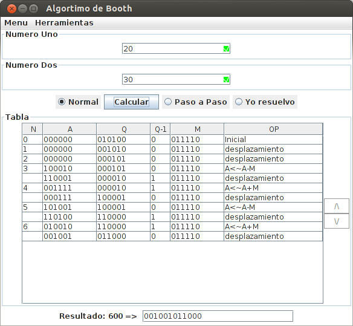

# booj: Booth algorithm in java

**booj** is a dummie implementation of booth's algorithm in java. 



## Install

**booj** requires javac and java 7 or above.

Clone/download the repository and add to your favorite IDE

## Usage
```
java -jar AlgoritmoBooth.jar
```
## License

**booj** is available under the MIT license. See the LICENSE file for
more information.
